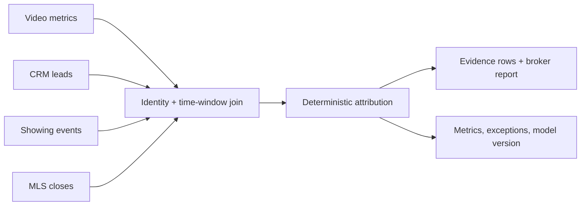

# Architecture

The static Pages build imports `data/demo.json` and performs the same documented calculation client-side so it remains interactive without a server. `api/main.py` is the production boundary prototype and is tested, but not deployed.

## Contract

`POST /attribution` accepts `listing_id`, `window_days` (7–90) and model (`balanced`, `outcomes`, `reach`). It returns counts, attributed revenue, confidence and ranked videos.

## Shadow paths

- Invalid shape/range → FastAPI 422; UI names the allowed window.
- Unknown listing → 404 `Listing not found`.
- Valid listing with zero in-window events → 409 `No linked outcomes inside attribution window`.
- Connector timeout (future) → run remains failed with source-specific reason; previous completed report stays visible.
- Duplicate source event (future) → idempotency key prevents double credit.

## Security and observability

Production: tenant-scoped OAuth tokens in a secret manager, encryption at rest, least-privilege connectors, PII minimization, audit logs, deletion controls, run duration/error metrics, match-rate histogram, stale-connector alert and an attribution rollback runbook.
